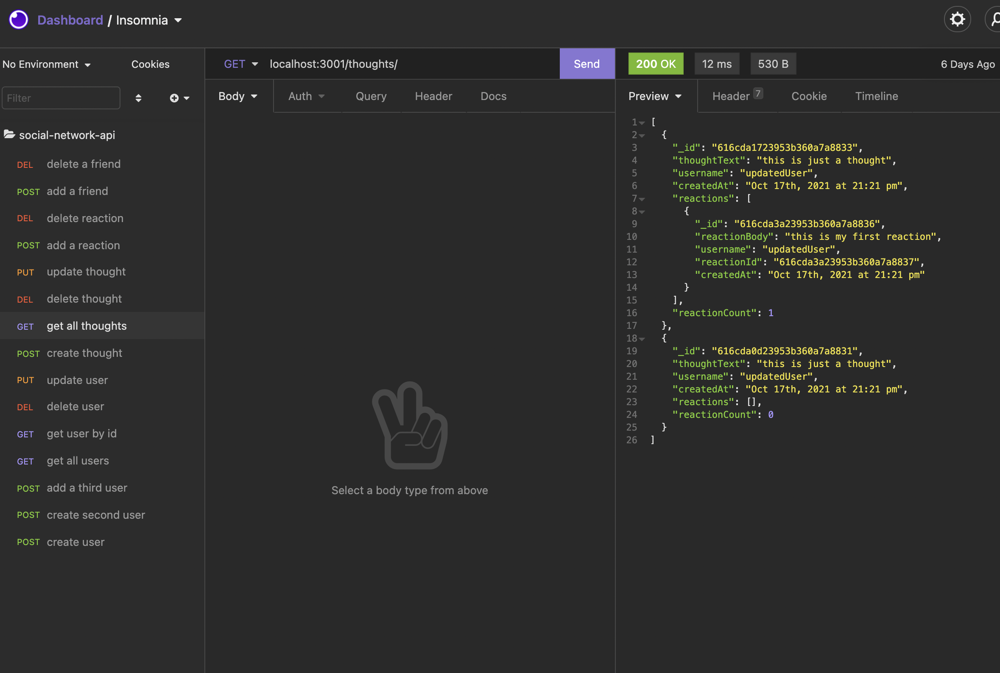

# social-network-api

## A simple build of the api architecture for a hypothetical social network. A user can test the functionality of the basic requirements of a social network: users, friends, posts (here called "thoughts") and replies ('reactions").

## Languages

JS
MongoDB
Mongoose
express
Node

## Screenshot

## Created by

Thomas Upchurch

## Contact

thomascupchurch@gmail.com
github.com/thomascupchurch
